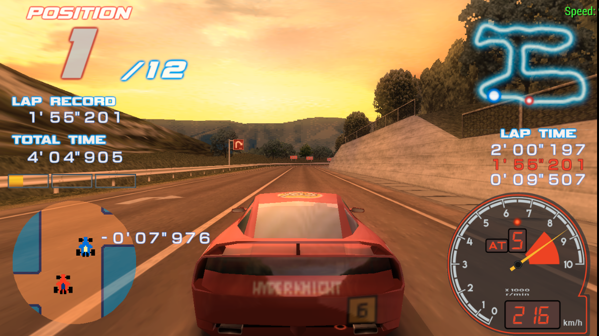

# Ridge Racer 2 - HD Texture Project (Repacked)

Combined High Definition HUD's &amp; UI textures from Abbanon &amp; R-Type Leo's packages

## Features

- Based from [1.2 pack] (probably dead)
- Merged from [R-Type Leo's Replacement UI]

## What's the difference?

- Used HD dials which is unavailable on base texture pack

## Compatibility

### Only compatible on the following:

- `UCAS40119`
- `UCES00422`

### Notes:

- This was initially supported on `UCES00422`. I just found that other regions like `UCAS40119` are also compatible, so if you have that one instead of the `UCES00422`, just rename it into `UCAS40119`
- Not compatible on Japanese regions

[1.2 pack]: https://forums.ppsspp.org/showthread.php?tid=25052
[R-Type Leo's Replacement UI]: https://forums.ppsspp.org/showthread.php?tid=22241