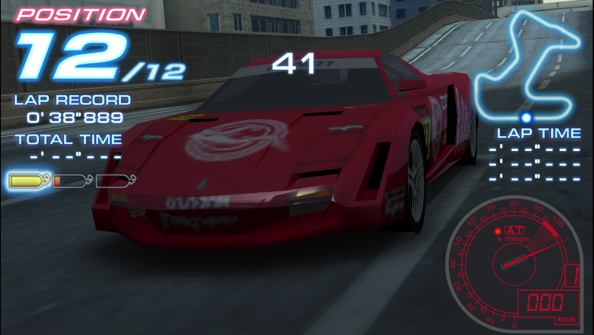

# Ridge Racer 2 - Texture Re-Package Project

A re-package of two existing HD Texture packs, with retaining the original design.

Combined High Definition HUD's &amp; UI textures from Abbanon &amp; R-Type Leo's packages

## Features

- Based from [Abbanon's pack](https://forums.ppsspp.org/showthread.php?tid=25052) ([v1](UCES00422/v1))
- Merged from [R-Type Leo's Replacement UI](https://forums.ppsspp.org/showthread.php?tid=22241) ([v2](UCES00422/v2))

## What's the difference?

- Used HD dials which is unavailable on base texture pack (v1).
- Disabled some elements especially on HUD, to retain authenticity of original HUD design from Bandai Namco & to match HUD from Ridge Racer 6.

## Compatibility

### Only compatible on the following

- `UCAS40119`
- `UCES00422`

### Notes

- This was initially supported on `UCES00422`. I just found that other regions like `UCAS40119` are also compatible, so if you have that one instead of the `UCES00422`, just rename it into `UCAS40119`
- Not compatible with Japanese regions.
